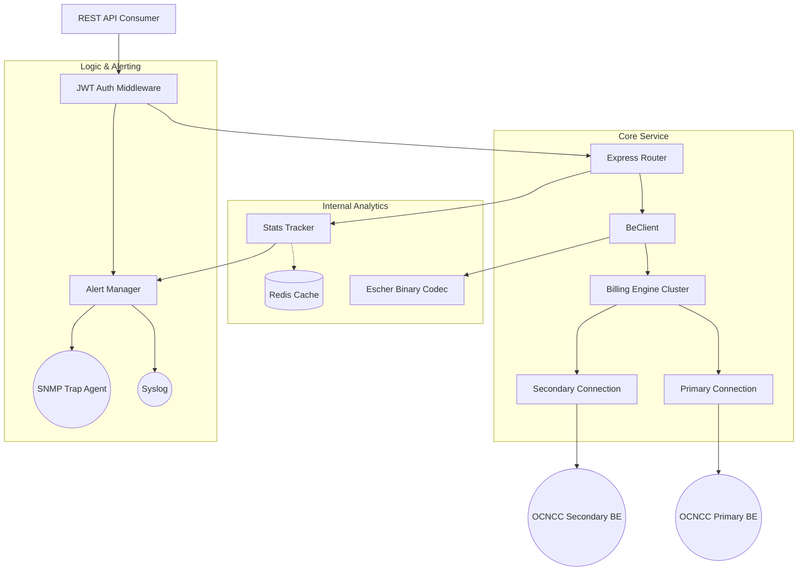
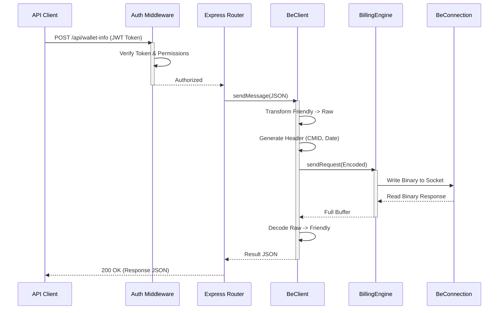

# OCNCC Billing Engine REST API — Complete Integration & Architecture Guide

> **© 2026 Blue Bridge Software Ltd. All rights reserved.**  
> Author: Tony Craven  
> Document Version: 2.0 — March 2026

---

## Table of Contents

1. [Overview](#1-overview)
   - 1.1 [Prerequisites & Installation](#11-prerequisites--installation)
   - 1.2 [Development & Testing](#12-development--testing)
2. [Architecture](#2-architecture)
   - 2.1 [Component Relationship](#21-component-relationship)
   - 2.2 [Request Flow Sequence](#22-request-flow-sequence)
3. [Security, Authentication & Alerting](#3-security-authentication--alerting)
   - 3.1 [Token Format](#31-token-format)
   - 3.2 [Token Structure](#32-token-structure)
   - 3.3 [Generating a Token](#33-generating-a-token)
   - 3.4 [Authentication Errors](#34-authentication-errors)
   - 3.5 [Security Restrictions](#35-security-restrictions)
   - 3.6 [Fraud & Attack Detection](#36-fraud--attack-detection)
4. [Message Format](#4-message-format)
   - 4.1 [Dual-Format Support (Raw vs Friendly)](#41-dual-format-support-raw-vs-friendly)
   - 4.2 [Common Message Structure](#42-common-message-structure)
   - 4.3 [Header Fields](#43-header-fields)
   - 4.4 [Action Types (ACTN)](#44-action-types-actn)
   - 4.5 [Response Format](#45-response-format)
5. [REST API Endpoints](#5-rest-api-endpoints)
   - 5.1 [POST /api/wallet-info](#51-post-apiwallet-info)
   - 5.2 [POST /api/initial-reservation](#52-post-apiinitial-reservation)
   - 5.3 [GET /api/stats](#53-get-apistats)
6. [Message Type Reference](#6-message-type-reference)
   - 6.1 [Wallet Operations](#61-wallet-operations)
   - 6.2 [Call Reservation Flow](#62-call-reservation-flow)
   - 6.3 [Named Event Operations](#63-named-event-operations)
   - 6.4 [Amount Reservation Operations](#64-amount-reservation-operations)
   - 6.5 [Direct Amount Operations](#65-direct-amount-operations)
   - 6.6 [Rate Query Operations](#66-rate-query-operations)
   - 6.7 [Voucher Operations](#67-voucher-operations)
   - 6.8 [Administrative Operations](#68-administrative-operations)
7. [Response Types](#7-response-types)
   - 7.1 [ACK (Positive Acknowledgement)](#71-ack-positive-acknowledgement)
   - 7.2 [NACK (Negative Acknowledgement)](#72-nack-negative-acknowledgement)
   - 7.3 [EXCP (Exception)](#73-excp-exception)
8. [NAck Code Reference](#8-nack-code-reference)
9. [Exception Code Reference](#9-exception-code-reference)
10. [Wallet State Reference](#10-wallet-state-reference)
11. [Balance Limit Type Reference](#11-balance-limit-type-reference)
12. [Error Handling](#12-error-handling)
13. [Integration Examples](#13-integration-examples)
14. [Security Best Practices](#14-security-best-practices)
15. [Field Symbol Reference (Raw Format)](#15-field-symbol-reference-raw-format)
16. [Extended Wallet Features](#16-extended-wallet-features)
    - 16.1 [Future-Dated Buckets (STDT)](#161-future-dated-buckets-stdt)
    - 16.2 [Multi-Bucket Updates in a Single Message](#162-multi-bucket-updates-in-a-single-message)
    - 16.3 [Extended Message Fields](#163-extended-message-fields)

---

## 1. Overview

The BBS OCNCC Billing Engine Client is a high-performance, concurrent Node.js service designed to interface with the Oracle OCNCC Billing Engine using the **Escher binary protocol**. It exposes a modern RESTful API that abstracts the complexities of the binary protocol, providing primary/secondary failover, congestion control, and robust security.

The OCNCC Billing Engine (BE) REST API provides a JSON-over-HTTP bridge to the underlying BE messaging platform (Oracle Communications Network Charging and Control). It allows third-party systems to perform real-time balance management operations — including wallet queries, call reservations, direct charges, voucher redemptions, and wallet lifecycle management — without needing to implement the native Escher binary messaging protocol.

The REST API accepts JSON payloads in either **Raw** (4-character symbol) format or **Friendly** (human-readable label) format, translates them to native BE Protocol messages, forwards them to the configured BE Server(s), and returns the response in the same format the request was received in.

**Base URL:**
```
http://<host>:3010/api
```

**Transport:** HTTP/1.1 (HTTPS recommended in production)

**Data Format:** `application/json`

### 1.1 Prerequisites & Installation

- **Prerequisites:** Node.js 18+, (Optional) Redis server for enhanced analytics and caching.
- **Setup:**
  1. Clone the repository and navigate to the project directory
  2. `npm install` to install dependencies
  3. `cp .env.example .env` and configure the following:
     - Primary and Secondary BE Server IPs and ports
     - JWT Secret (`BE_JWT_SECRET`)
     - Redis connection details (if using Redis)
     - SNMP and Syslog settings for alerting
  4. `node js/server.js` to start the REST API gateway

### 1.2 Development & Testing

- **Codec Test:** `node js/test-codec.js` — Validates Escher binary codec functionality
- **Security Test:** `node js/test-security.js` — Tests JWT authentication and ACL enforcement
- **Integration Example:** `node js/example-integration.js` — Demonstrates common API usage patterns

---

## 2. Architecture

### 2.1 Component Relationship



**Architecture Overview:**

```
Third-Party Client
      │
      │  HTTP POST (JSON)
      ▼
OCNCC REST API Gateway (Node.js, port 3010)
      │  JWT Authentication & Endpoint ACL
      │  JSON → BE Protocol Message translation
      ▼
BE Client  ──TCP──►  BE Server (Primary)
                └──TCP──►  BE Server (Secondary / Failover)
                               │
                               ▼
                          BE VWARS (Wallet/Account processing)
```

The gateway supports automatic failover between a primary and secondary BE Server. The `preferredEngine` query parameter allows callers to hint which engine to attempt first.

### 2.2 Request Flow Sequence



---

## 3. Security, Authentication & Alerting

All API endpoints (except health checks, if present) require a **JWT Bearer token** in the `Authorization` header. The API is protected by **scoped JWT tokens**, where each client is issued a token reflecting their allowed endpoints.

### 3.1 Token Format

```
Authorization: Bearer <JWT_TOKEN>
```

### 3.2 Token Structure

Tokens must be signed with the shared secret configured via the `BE_JWT_SECRET` environment variable on the server. Tokens are issued and managed by the integrating system; the API gateway validates them on each request.

**JWT Payload fields:**

| Field | Type | Required | Description |
|---|---|---|---|
| `clientId` | string | Yes | Unique identifier for the calling system. Recorded in `/api/stats`. |
| `allowedEndpoints` | string[] | Yes | List of API endpoints this token is permitted to call. E.g. `["/wallet-info", "/stats"]` |
| `exp` | number | Yes (standard) | Unix timestamp when the token expires. Tokens with no `exp` will be rejected. |
| `iat` | number | Recommended | Unix timestamp when the token was issued. |

**Example Token Payload:**
```json
{
  "clientId": "MyBillingSystem",
  "allowedEndpoints": ["/wallet-info", "/initial-reservation", "/stats"],
  "iat": 1743000000,
  "exp": 1743003600
}
```

### 3.3 Generating a Token

**Node.js Example:**

```javascript
const jwt = require('jsonwebtoken');

const token = jwt.sign(
  {
    clientId: 'MyBillingSystem',
    allowedEndpoints: ['/wallet-info', '/initial-reservation', '/stats']
  },
  process.env.BE_JWT_SECRET,
  { expiresIn: '1h' }
);
```

### 3.4 Authentication Errors

| HTTP Status | Condition |
|---|---|
| `401 Unauthorized` | No `Authorization` header provided, or token is missing/malformed. |
| `401 Unauthorized` | Token signature is invalid (wrong secret). |
| `401 Unauthorized` | Token has expired (`exp` is in the past). |
| `403 Forbidden` | Token is valid but the requested endpoint is not in `allowedEndpoints`. |

Unauthorised attempts are counted in the `/api/stats` response under `unauthorisedAttempts`.

### 3.5 Security Restrictions

- Tokens **must** have an expiry (`exp`). Tokens without an expiry claim are rejected.
- The `BE_JWT_SECRET` must be a strong random value. The default value `YOUR_SUPER_SECRET_KEY_CHANGE_IN_PRODUCTION` **must never be used in production**.
- Token scope is enforced per-endpoint. A token granted access to `/wallet-info` cannot call `/initial-reservation` unless that endpoint is also listed in `allowedEndpoints`.
- Tokens should be kept confidential. Do not embed them in client-side JavaScript or public repositories.
- Tokens should have a short expiry (e.g. 1 hour) and be rotated regularly.

### 3.6 Fraud & Attack Detection

The `AlertManager` monitors for security anomalies and dispatches alerts via multiple channels:

- **Unauthorised Access:** Invalid or missing tokens trigger alerts and increment the `unauthorisedAttempts` counter.
- **ACL Violations:** Valid tokens attempting to access unpermitted routes generate security alerts.
- **Alert Dispatch Channels:**
  - **Syslog** (Local0 facility) for centralized log aggregation
  - **SNMP V2 Traps** using BBS Enterprise OIDs (`1.3.6.1.4.1.99999.1`)
  
All security events are logged with full context including client ID, endpoint, timestamp, and IP address for forensic analysis.

---

## 4. Message Format

### 4.1 Dual-Format Support (Raw vs Friendly)

The API accepts messages in two formats and automatically detects which is being used based on the presence of known keys.

**Raw Format** uses terse 4-character symbol codes, identical to the native BE Protocol wire format. This is suitable for legacy systems or direct integrations.

**Friendly Format** uses human-readable field names. The server detects this format and returns responses in the same friendly format.

The server's response will mirror the format of the request — send raw, receive raw; send friendly, receive friendly.

**Example: Wallet Info Request in Raw Format**
```json
{
  "ACTN": "REQ ",
  "TYPE": "WI  ",
  "HEAD": {
    "CMID": 1055,
    "SVID": 1
  },
  "BODY": {
    "WALT": 447700900123,
    "BTYP": 2
  }
}
```

**Example: Wallet Info Request in Friendly Format**
```json
{
  "FOX Action": "REQ ",
  "FOX Type": "WI  ",
  "Header": {
    "Request Number (CMID)": 1055,
    "BE Server ID": 1
  },
  "Body": {
    "Wallet Reference": 447700900123,
    "Balance Type": 2
  }
}
```

> **Note:** All examples in this document use **Raw format** for precision. The 4-character symbols are the authoritative field identifiers. Trailing spaces in symbols (e.g. `"REQ "`, `"WI  "`) are **significant** and must be included.

---

### 4.2 Common Message Structure

Every BE Protocol message has the same top-level structure:

```json
{
  "ACTN": "<action>",
  "TYPE": "<message-type>",
  "HEAD": { ... },
  "BODY": { ... }
}
```

| Field | Symbol | Type | Description |
|---|---|---|---|
| Action | `ACTN` | Symbol (4-char) | The message action. See [Section 4.4](#44-action-types-actn). |
| Type | `TYPE` | Symbol (4-char) | The message type. Identifies the specific operation. |
| Header | `HEAD` | Map | Common routing and correlation fields. |
| Body | `BODY` | Map | Operation-specific fields. |

---

### 4.3 Header Fields

The `HEAD` map is common to all messages and contains routing and correlation information.

| Symbol | Name | Type | M/O | Description |
|---|---|---|---|---|
| `SVID` | BE Server ID | int | **M** | Identifies which BE Server handled the message. Always `1` for requests. |
| `CMID` | Client Message ID | int | **M** | Unique request identifier. Used for correlation. Must be unique per client. |
| `DATE` | Date/time | date | **M** | Unix timestamp when the message was created. |
| `USEC` | Microseconds | int | O | Microsecond component of the timestamp (0-999999). |
| `VER ` | Protocol Version | int | O | BE Protocol version (typically `2`). |
| `DUP ` | Duplicate flag | int | O | Set to `1` if this is a retransmission of a previous request. |

**Auto-Generated Fields:**

The REST API gateway automatically populates `CMID`, `DATE`, and `USEC` if not provided in the request. You can override these values if needed for testing or correlation purposes.

---

### 4.4 Action Types (ACTN)

The `ACTN` field indicates the message direction and purpose.

| Symbol | Name | Direction | Description |
|---|---|---|---|
| `REQ ` | Request | Client → Server | A request for an operation to be performed. |
| `ACK ` | Acknowledgement | Server → Client | Successful completion of a request. |
| `NACK` | Negative Acknowledgement | Server → Client | Request rejected due to business logic failure. |
| `EXCP` | Exception | Server → Client | Request failed due to a system error. |
| `ABRT` | Abort | Client → Server | Abort a pending operation (rarely used). |

> **Note:** Trailing spaces in action symbols are significant and must be included.

---

### 4.5 Response Format

All responses follow the same structure as requests, with the `ACTN` field indicating the outcome:

**Success Response (ACK):**
```json
{
  "ACTN": "ACK ",
  "TYPE": "WI  ",
  "HEAD": {
    "SVID": 1,
    "CMID": 1055,
    "DATE": 1743123456
  },
  "BODY": {
    "WALT": 447700900123,
    "STAT": "ACTV",
    "BALS": [ ... ]
  }
}
```

**Failure Response (NACK):**
```json
{
  "ACTN": "NACK",
  "TYPE": "WI  ",
  "HEAD": {
    "SVID": 1,
    "CMID": 1055,
    "DATE": 1743123456
  },
  "BODY": {
    "CODE": "NF  ",
    "WHAT": "Wallet not found"
  }
}
```

**Exception Response (EXCP):**
```json
{
  "ACTN": "EXCP",
  "TYPE": "WI  ",
  "HEAD": {
    "SVID": 1,
    "CMID": 1055,
    "DATE": 1743123456
  },
  "BODY": {
    "CODE": "DBOK",
    "WHAT": "Database connection timeout"
  }
}
```

---

## 5. REST API Endpoints

### 5.1 POST /api/wallet-info

Retrieves comprehensive wallet information including current state, balances, and bucket details.

**Endpoint:** `POST /api/wallet-info`

**Authentication:** Required (JWT Bearer Token)

**Request Body:**

| Field | Symbol | Type | M/O | Description |
|---|---|---|---|---|
| Wallet ID | `WALT` | int | **M** (or `WALR`) | Numeric wallet identifier. |
| Wallet Reference | `WALR` | string | **M** (or `WALT`) | String wallet reference (typically MSISDN). |
| Balance Type | `BTYP` | int | O | Specific balance type to query. Omit to retrieve all balances. |
| Start Date No Filter | `SDNF` | null | O | Set to `null` to include future-dated buckets. |

> **Note:** Provide either `WALT` (numeric ID) or `WALR` (string reference), but not both.

**Example Request (Raw Format):**
```json
{
  "ACTN": "REQ ",
  "TYPE": "WI  ",
  "HEAD": {
    "CMID": 1055,
    "SVID": 1
  },
  "BODY": {
    "WALR": "447700900123"
  }
}
```

**Example Response (ACK):**
```json
{
  "ACTN": "ACK ",
  "TYPE": "WI  ",
  "HEAD": {
    "SVID": 1,
    "CMID": 1055,
    "DATE": 1743123456,
    "USEC": 123456
  },
  "BODY": {
    "WALT": 447700900123,
    "STAT": "ACTV",
    "EXPR": 1805571629,
    "ACTV": 1774035629,
    "LUSE": 1743000000,
    "MAXC": 3,
    "SCUR": 826,
    "UCUR": 826,
    "BALS": [
      {
        "BTYP": 1,
        "LIMT": "DEBT",
        "STOT": 45000,
        "BUNT": 1,
        "BKTS": [
          {
            "ID  ": 1,
            "VAL ": 45000,
            "EXPR": 1805571629
          }
        ]
      }
    ]
  }
}
```

**Response Fields:**

| Symbol | Name | Type | Description |
|---|---|---|---|
| `WALT` | Wallet ID | int | The wallet identifier. |
| `STAT` | State | Symbol | Wallet state (e.g., `ACTV`, `SUSP`, `TERM`). See [Section 10](#10-wallet-state-reference). |
| `EXPR` | Expiry Date | date | Unix timestamp when the wallet expires. |
| `ACTV` | Activation Date | date | Unix timestamp when the wallet was activated. |
| `LUSE` | Last Used | date | Unix timestamp of last activity. |
| `MAXC` | Max Concurrent | int | Maximum concurrent sessions allowed. |
| `SCUR` | System Currency | int | ISO 4217 currency code (e.g., 826 = GBP). |
| `UCUR` | User Currency | int | User-facing currency code. |
| `BALS` | Balances Array | array | Array of balance objects. |

**Balance Object Structure:**

| Symbol | Name | Type | Description |
|---|---|---|---|
| `BTYP` | Balance Type | int | Balance type identifier. |
| `LIMT` | Limit Type | Symbol | Credit limit type. See [Section 11](#11-balance-limit-type-reference). |
| `STOT` | System Total | int | Total balance in system currency (minor units). |
| `BUNT` | Balance Unit | int | Unit of measurement for this balance. |
| `BKTS` | Buckets Array | array | Array of bucket objects containing balance details. |

**Bucket Object Structure:**

| Symbol | Name | Type | Description |
|---|---|---|---|
| `ID  ` | Bucket ID | int | Unique bucket identifier within the balance. |
| `VAL ` | Value | int | Current bucket value (in minor units or specified units). |
| `EXPR` | Expiry Date | date | Unix timestamp when the bucket expires. |
| `STDT` | Start Date | date | Unix timestamp when the bucket becomes active (if future-dated). |

---

### 5.2 POST /api/initial-reservation

Initiates a call reservation, reserving credit for a voice call or session.

**Endpoint:** `POST /api/initial-reservation`

**Authentication:** Required (JWT Bearer Token)

**Request Body:**

| Field | Symbol | Type | M/O | Description |
|---|---|---|---|---|
| Wallet ID | `WALT` | int | **M** | The wallet to reserve credit from. |
| Calling Line ID | `CLI ` | string | **M** | Calling party number (A-number). |
| Dialled Number | `DN  ` | string | **M** | Destination number (B-number). |
| Call Date | `CDAT` | date | **M** | Unix timestamp of call start. |
| Time Zone | `TZ  ` | string | **M** | Timezone identifier (e.g., `"Europe/London"`). |
| Expected Reservation Length | `ERSL` | int | **M** | Expected call duration in seconds. |
| Precision | `PREC` | Symbol | **M** | Rating precision (`SECS` = per-second, `60  ` = per-minute). |
| Call Scenario Code | `CSC ` | string | O | Call scenario identifier for rating. |
| Subscriber Number | `SUBN` | string | O | Subscriber identifier. |
| Service Provider ID | `SPID` | int | O | Service Provider identifier. |

**Example Request (Raw Format):**
```json
{
  "ACTN": "REQ ",
  "TYPE": "IR  ",
  "HEAD": {
    "CMID": 2001,
    "SVID": 1
  },
  "BODY": {
    "WALT": 447700900123,
    "CLI ": "447700900123",
    "DN  ": "442071234567",
    "CDAT": 1743123456,
    "TZ  ": "Europe/London",
    "ERSL": 300,
    "PREC": "SECS",
    "CSC ": "STD_UK_MOBILE"
  }
}
```

**Example Response (ACK):**
```json
{
  "ACTN": "ACK ",
  "TYPE": "IR  ",
  "HEAD": {
    "SVID": 1,
    "CMID": 2001,
    "DATE": 1743123456
  },
  "BODY": {
    "WALT": 447700900123,
    "NUM ": 120,
    "TOT ": 2400,
    "LOWT": 0,
    "FCD ": "NFCD"
  }
}
```

**Response Fields:**

| Symbol | Name | Type | Description |
|---|---|---|---|
| `WALT` | Wallet ID | int | The wallet identifier. |
| `NUM ` | Number / Units | int | Number of seconds (or units) reserved. |
| `TOT ` | Total | int | Total cost reserved (in minor currency units). |
| `LOWT` | Low Credit Time | int | Seconds until low credit warning (0 = no warning). |
| `FCD ` | Free Call Disposition | Symbol | Free call indicator (`NFCD` = not free, `FRCL` = free call). |

**Important Notes:**

- The reservation must be followed by either:
  - `SR` (Subsequent Reservation) messages to extend the reservation
  - `CR` (Commit Reservation) to finalize and charge
  - `RR` (Revoke Reservation) to cancel and release credit
- Unreleased reservations will timeout according to the wallet's reservation policy
- Multiple concurrent reservations are allowed up to the `MAXC` limit

---

### 5.3 GET /api/stats

Retrieves operational statistics and metrics for the API gateway.

**Endpoint:** `GET /api/stats`

**Authentication:** Required (JWT Bearer Token with `/stats` permission)

**Response:**
```json
{
  "uptime": 86400,
  "totalRequests": 15234,
  "successfulRequests": 14892,
  "failedRequests": 342,
  "unauthorisedAttempts": 15,
  "endpointStats": {
    "/wallet-info": {
      "count": 12456,
      "avgResponseTime": 45
    },
    "/initial-reservation": {
      "count": 2436,
      "avgResponseTime": 52
    }
  },
  "clientStats": {
    "MyBillingSystem": {
      "requests": 10234,
      "lastSeen": 1743123456
    }
  },
  "billingEngineStatus": {
    "primary": "connected",
    "secondary": "connected",
    "preferredEngine": "primary"
  }
}
```

**Response Fields:**

| Field | Type | Description |
|---|---|---|
| `uptime` | int | Gateway uptime in seconds. |
| `totalRequests` | int | Total number of requests processed. |
| `successfulRequests` | int | Requests that received ACK responses. |
| `failedRequests` | int | Requests that received NACK or EXCP responses. |
| `unauthorisedAttempts` | int | Number of failed authentication attempts. |
| `endpointStats` | object | Per-endpoint usage statistics. |
| `clientStats` | object | Per-client usage statistics (keyed by `clientId`). |
| `billingEngineStatus` | object | Current status of BE server connections. |

---

## 6. Message Type Reference

The following section documents all supported BE Protocol message types. While the REST gateway currently exposes `/wallet-info` and `/initial-reservation` as dedicated endpoints, the underlying message protocol supports a full range of operations. Future endpoint additions will use the same message structures described here.

---

### 6.1 Wallet Operations

#### WI — Wallet Info

Retrieves the current state and balance details of a wallet. See [Section 5.1](#51-post-apiwallet-info) for full detail.

| | |
|---|---|
| **Type Symbol** | `WI  ` |
| **Request Action** | `REQ ` |
| **Success Response** | `ACK ` |
| **Failure Response** | `NACK` |

---

#### WC — Wallet Create

Creates a new wallet with an initial set of balances and buckets.

| | |
|---|---|
| **Type Symbol** | `WC  ` |
| **Request Action** | `REQ ` |
| **Success Response** | `ACK ` |

**Request Body Fields:**

| Symbol | Name | Type | M/O | Description |
|---|---|---|---|---|
| `WALT` | Wallet ID | int | **M** | Pass `0` to allow the system to assign an ID. |
| `CLI ` | Calling Line ID | string | **M** | Subscriber MSISDN. |
| `WTYP` | Wallet Type | int | **M** | Wallet type identifier. |
| `ACTY` | Account Type | int | **M** | Account type ID. |
| `STAT` | State | Symbol | **M** | Initial wallet state. See [Section 10](#10-wallet-state-reference). |
| `MAXC` | Max Concurrent | int | **M** | Maximum concurrent sessions. |
| `EXPR` | Expiry Date | date (Unix) | **M** | When the wallet expires. |
| `ACTV` | Activation Date | date (Unix) | **M** | When the wallet becomes active. |
| `SPID` | Service Provider ID | int | **M** | Service Provider identifier. |
| `ABAL` | Alter Balances | array | **M** | Array of `BalanceInfo` objects defining the initial balances. |

**Example Request:**
```json
{
  "ACTN": "REQ ",
  "TYPE": "WC  ",
  "HEAD": { "SVID": 1, "CMID": 8001 },
  "BODY": {
    "WALT": 0,
    "CLI ": "447700900123",
    "WTYP": 1,
    "ACTY": 5,
    "STAT": "ACTV",
    "MAXC": 3,
    "EXPR": 1805571629,
    "ACTV": 1774035629,
    "SPID": 101,
    "ABAL": [
      {
        "BTYP": 1,
        "LIMT": "DEBT",
        "BKTS": [
          { "ID  ": 0, "VAL ": 100000, "EXPR": null }
        ]
      }
    ]
  }
}
```

**Example Response:**
```json
{
  "ACTN": "ACK ",
  "TYPE": "WC  ",
  "HEAD": {
    "SVID": 1,
    "CMID": 8001,
    "DATE": 1743123456
  },
  "BODY": {
    "WALT": 447700900124
  }
}
```

---

#### WU — Wallet Update

Updates an existing wallet's properties and/or balances.

| | |
|---|---|
| **Type Symbol** | `WU  ` |
| **Request Action** | `REQ ` |
| **Success Response** | `ACK ` |

**Request Body Fields:**

| Symbol | Name | Type | M/O | Description |
|---|---|---|---|---|
| `WALT` | Wallet ID | int | **M** | The wallet to update. |
| `AREF` | Account Reference | int | O | Account reference ID. |
| `ACTY` | Account Type | int | O | Account type ID. |
| `STAT` | State | Symbol | O | New wallet state. |
| `MAXC` | Max Concurrent | int | O | New maximum concurrent sessions value. |
| `SPLG` | Suppress Plugins | null | O | If `null`, suppresses plugin execution. |
| `ABID` | Account Batch ID | int | O | Account batch ID. |
| `NACT` | New Account Type | int | O | New account type (replaces `ACTY`). |
| `ABAL` | Alter Balances | array | O | Array of balance modifications. |
| `APOL` | Account Expiry Policy | Symbol | O | Account expiry policy (`KEEP`, `EXTN`, `REPL`). |
| `BPOL` | Balance Expiry Policy | Symbol | O | Balance expiry policy (`KEEP`, `EXTN`, `REPL`). |
| `AEXT` | Account Expiry Extension | int | O | Account expiry extension in seconds. |
| `BEXT` | Balance Expiry Extension | int | O | Balance expiry extension in seconds. |
| `AEXP` | Account Expiry Date | date | O | New account expiry date (Unix timestamp). |

**Example Request:**
```json
{
  "ACTN": "REQ ",
  "TYPE": "WU  ",
  "HEAD": { "SVID": 1, "CMID": 8002 },
  "BODY": {
    "WALT": 12345,
    "AREF": 999,
    "ACTY": 5,
    "STAT": "ACTV",
    "MAXC": 5,
    "SPLG": null,
    "ABID": 0,
    "NACT": 6,
    "ABAL": [
      {
        "BTYP": 1,
        "BKTS": [ { "ID  ": 1, "VAL ": 5000 } ]
      }
    ]
  }
}
```

**Example Response:**
```json
{
  "ACTN": "ACK ",
  "TYPE": "WU  ",
  "HEAD": {
    "SVID": 1,
    "CMID": 8002,
    "DATE": 1743123456
  },
  "BODY": {
    "WALT": 12345
  }
}
```

---

#### WD — Wallet Delete

Permanently deletes a wallet.

| | |
|---|---|
| **Type Symbol** | `WD  ` |
| **Request Action** | `REQ ` |
| **Success Response** | `ACK ` |

**Request Body Fields:**

| Symbol | Name | Type | M/O | Description |
|---|---|---|---|---|
| `WALT` | Wallet ID | int | **M** | The wallet to delete. |
| `CLI ` | Calling Line ID | string | **M** | Subscriber MSISDN (for audit). |
| `WTYP` | Wallet Type | int | **M** | Wallet type. |
| `ACTY` | Account Type | int | **M** | Account type. |
| `DLKW` | Delete Locked Wallet | null | O | If present (as `null`), allows deletion even if the wallet is locked. |
| `DLRM` | Don't Log Remove | null | O | If present, suppresses the removal log entry. |

**Example Request:**
```json
{
  "ACTN": "REQ ",
  "TYPE": "WD  ",
  "HEAD": { "SVID": 1, "CMID": 8003 },
  "BODY": {
    "WALT": 447700900123,
    "CLI ": "447700900123",
    "WTYP": 1,
    "ACTY": 5
  }
}
```

**Example Response:**
```json
{
  "ACTN": "ACK ",
  "TYPE": "WD  ",
  "HEAD": {
    "SVID": 1,
    "CMID": 8003,
    "DATE": 1743123456
  },
  "BODY": {}
}
```

---

#### WRI — Wallet Reservations Info

Retrieves information about all active reservations on a wallet.

| | |
|---|---|
| **Type Symbol** | `WRI ` |
| **Request Action** | `REQ ` |
| **Success Response** | `ACK ` |

**Request Body Fields:**

| Symbol | Name | Type | M/O | Description |
|---|---|---|---|---|
| `WALT` | Wallet ID | int | **M** | The wallet to query. |

**Example Request:**
```json
{
  "ACTN": "REQ ",
  "TYPE": "WRI ",
  "HEAD": { "SVID": 1, "CMID": 8004 },
  "BODY": {
    "WALT": 447700900123
  }
}
```

**Example Response:**
```json
{
  "ACTN": "ACK ",
  "TYPE": "WRI ",
  "HEAD": {
    "SVID": 1,
    "CMID": 8004,
    "DATE": 1743123456
  },
  "BODY": {
    "WALT": 447700900123,
    "RSVS": [
      {
        "CMID": 2001,
        "RSRV": 2400,
        "CDAT": 1743123400
      }
    ]
  }
}
```

**Response Fields:**

| Symbol | Name | Type | Description |
|---|---|---|---|
| `WALT` | Wallet ID | int | The wallet identifier. |
| `RSVS` | Reservations Array | array | Array of active reservation objects. |

**Reservation Object Structure:**

| Symbol | Name | Type | Description |
|---|---|---|---|
| `CMID` | Client Message ID | int | The CMID of the reservation request. |
| `RSRV` | Reserved Amount | int | Amount currently reserved (minor units). |
| `CDAT` | Call Date | date | Unix timestamp when the reservation started. |

---

#### WRE — Wallet Reservation End

Ends all active reservations on a wallet (emergency operation).

| | |
|---|---|
| **Type Symbol** | `WRE ` |
| **Request Action** | `REQ ` |
| **Success Response** | `ACK ` |

**Request Body Fields:**

| Symbol | Name | Type | M/O | Description |
|---|---|---|---|---|
| `WALT` | Wallet ID | int | **M** | The wallet whose reservations should be ended. |

**Example Request:**
```json
{
  "ACTN": "REQ ",
  "TYPE": "WRE ",
  "HEAD": { "SVID": 1, "CMID": 8005 },
  "BODY": {
    "WALT": 447700900123
  }
}
```

---

#### WGR — Wallet General Recharge

Performs a general recharge operation on a wallet.

| | |
|---|---|
| **Type Symbol** | `WGR ` |
| **Request Action** | `REQ ` |
| **Success Response** | `ACK ` |

**Request Body Fields:**

| Symbol | Name | Type | M/O | Description |
|---|---|---|---|---|
| `WALT` | Wallet ID | int | **M** | The wallet to recharge. |
| `RBAA` | Recharge Balance Array | array | **M** | Array of balance recharge operations. |

**Example Request:**
```json
{
  "ACTN": "REQ ",
  "TYPE": "WGR ",
  "HEAD": { "SVID": 1, "CMID": 8006 },
  "BODY": {
    "WALT": 447700900123,
    "RBAA": [
      {
        "BTYP": 1,
        "AMNT": 10000
      }
    ]
  }
}
```

---

#### WSI — Wallet State Information

Retrieves only the state information of a wallet (lightweight query).

| | |
|---|---|
| **Type Symbol** | `WSI ` |
| **Request Action** | `REQ ` |
| **Success Response** | `ACK ` |

**Request Body Fields:**

| Symbol | Name | Type | M/O | Description |
|---|---|---|---|---|
| `WALT` | Wallet ID | int | **M** | The wallet to query. |

**Example Request:**
```json
{
  "ACTN": "REQ ",
  "TYPE": "WSI ",
  "HEAD": { "SVID": 1, "CMID": 8007 },
  "BODY": {
    "WALT": 447700900123
  }
}
```

**Example Response:**
```json
{
  "ACTN": "ACK ",
  "TYPE": "WSI ",
  "HEAD": {
    "SVID": 1,
    "CMID": 8007,
    "DATE": 1743123456
  },
  "BODY": {
    "WALT": 447700900123,
    "STAT": "ACTV",
    "EXPR": 1805571629,
    "ACTV": 1774035629
  }
}
```

---

#### MGW — Merge Wallets

Merges the balances from one wallet into another.

| | |
|---|---|
| **Type Symbol** | `MGW ` |
| **Request Action** | `REQ ` |
| **Success Response** | `ACK ` |

**Request Body Fields:**

| Symbol | Name | Type | M/O | Description |
|---|---|---|---|---|
| `WALT` | Target Wallet ID | int | **M** | The wallet to receive the merged balances. |
| `SWLT` | Source Wallet ID | int | **M** | The wallet to be merged (will be deleted). |

**Example Request:**
```json
{
  "ACTN": "REQ ",
  "TYPE": "MGW ",
  "HEAD": { "SVID": 1, "CMID": 8008 },
  "BODY": {
    "WALT": 447700900123,
    "SWLT": 447700900124
  }
}
```

---

### 6.2 Call Reservation Flow

#### IR — Initial Reservation

Initiates a call reservation, reserving credit for a voice call or session. See [Section 5.2](#52-post-apiinitial-reservation) for full detail.

| | |
|---|---|
| **Type Symbol** | `IR  ` |
| **Request Action** | `REQ ` |
| **Success Response** | `ACK ` |
| **Failure Response** | `NACK` |

---

#### SR — Subsequent Reservation

Extends an existing call reservation with additional credit.

| | |
|---|---|
| **Type Symbol** | `SR  ` |
| **Request Action** | `REQ ` |
| **Success Response** | `ACK ` |

**Request Body Fields:**

| Symbol | Name | Type | M/O | Description |
|---|---|---|---|---|
| `WALT` | Wallet ID | int | **M** | The wallet with the active reservation. |
| `CLI ` | Calling Line ID | string | **M** | Calling party number (must match IR). |
| `DN  ` | Dialled Number | string | **M** | Destination number (must match IR). |
| `CDAT` | Call Date | date | **M** | Call start time (must match IR). |
| `TUC ` | Total Units Consumed | int | **M** | Total units consumed so far (cumulative). |
| `ERSL` | Expected Reservation Length | int | **M** | Expected additional duration in seconds. |

**Example Request:**
```json
{
  "ACTN": "REQ ",
  "TYPE": "SR  ",
  "HEAD": { "SVID": 1, "CMID": 2002 },
  "BODY": {
    "WALT": 2,
    "CLI ": "447700900123",
    "DN  ": "442071234567",
    "CDAT": 1743123456,
    "TUC ": 120,
    "ERSL": 180
  }
}
```

**Example Response:**
```json
{
  "ACTN": "ACK ",
  "TYPE": "SR  ",
  "HEAD": {
    "SVID": 1,
    "CMID": 2002,
    "DATE": 1743123576
  },
  "BODY": {
    "WALT": 447700900123,
    "NUM ": 180,
    "TOT ": 3600,
    "LOWT": 0
  }
}
```

---

#### CR — Commit Reservation

Commits a call reservation, finalizing the charge and releasing any unused credit.

| | |
|---|---|
| **Type Symbol** | `CR  ` |
| **Request Action** | `REQ ` |
| **Success Response** | `ACK ` |

**Request Body Fields:**

| Symbol | Name | Type | M/O | Description |
|---|---|---|---|---|
| `WALT` | Wallet ID | int | **M** | The wallet with the active reservation. |
| `CLI ` | Calling Line ID | string | **M** | Calling party number (must match IR). |
| `DN  ` | Dialled Number | string | **M** | Destination number (must match IR). |
| `CDAT` | Call Date | date | **M** | Call start time (must match IR). |
| `TUC ` | Total Units Consumed | int | **M** | Actual total units consumed. |

**Example Request:**
```json
{
  "ACTN": "REQ ",
  "TYPE": "CR  ",
  "HEAD": { "SVID": 1, "CMID": 2003 },
  "BODY": {
    "WALT": 447700900123,
    "CLI ": "447700900123",
    "DN  ": "442071234567",
    "CDAT": 1743123456,
    "TUC ": 245
  }
}
```

**Example Response:**
```json
{
  "ACTN": "ACK ",
  "TYPE": "CR  ",
  "HEAD": {
    "SVID": 1,
    "CMID": 2003,
    "DATE": 1743123701
  },
  "BODY": {
    "WALT": 447700900123,
    "TOT ": 4900
  }
}
```

---

#### RR — Revoke Reservation

Revokes (cancels) a call reservation, releasing all reserved credit without charging.

| | |
|---|---|
| **Type Symbol** | `RR  ` |
| **Request Action** | `REQ ` |
| **Success Response** | `ACK ` |

**Request Body Fields:**

| Symbol | Name | Type | M/O | Description |
|---|---|---|---|---|
| `WALT` | Wallet ID | int | **M** | The wallet with the active reservation. |
| `CLI ` | Calling Line ID | string | **M** | Calling party number (must match IR). |
| `DN  ` | Dialled Number | string | **M** | Destination number (must match IR). |
| `CDAT` | Call Date | date | **M** | Call start time (must match IR). |
| `RESN` | Reason | Symbol | O | Reason for revocation (e.g., `FAIL`, `CANC`). |

**Example Request:**
```json
{
  "ACTN": "REQ ",
  "TYPE": "RR  ",
  "HEAD": { "SVID": 1, "CMID": 2004 },
  "BODY": {
    "WALT": 447700900123,
    "CLI ": "447700900123",
    "DN  ": "442071234567",
    "CDAT": 1743123456,
    "RESN": "FAIL"
  }
}
```

---

#### ATC — Apply Tariffed Charge

Applies a tariffed charge to a wallet without a reservation flow.

| | |
|---|---|
| **Type Symbol** | `ATC ` |
| **Request Action** | `REQ ` |
| **Success Response** | `ACK ` |

**Request Body Fields:**

| Symbol | Name | Type | M/O | Description |
|---|---|---|---|---|
| `WALT` | Wallet ID | int | **M** | The wallet to charge. |
| `CLI ` | Calling Line ID | string | **M** | Calling party number. |
| `DN  ` | Dialled Number | string | **M** | Destination number. |
| `CDAT` | Call Date | date | **M** | Charge timestamp. |
| `TZ  ` | Time Zone | string | **M** | Timezone identifier. |
| `NUM ` | Number / Units | int | **M** | Number of units consumed. |
| `CSC ` | Call Scenario Code | string | O | Call scenario for rating. |

**Example Request:**
```json
{
  "ACTN": "REQ ",
  "TYPE": "ATC ",
  "HEAD": { "SVID": 1, "CMID": 2005 },
  "BODY": {
    "WALT": 447700900123,
    "CLI ": "447700900123",
    "DN  ": "442071234567",
    "CDAT": 1743123456,
    "TZ  ": "Europe/London",
    "NUM ": 300,
    "CSC ": "STD_UK_MOBILE"
  }
}
```

---

### 6.3 Named Event Operations

#### NE — Named Event

Charges a wallet for a named event (e.g., SMS, data session).

| | |
|---|---|
| **Type Symbol** | `NE  ` |
| **Request Action** | `REQ ` |
| **Success Response** | `ACK ` |

**Request Body Fields:**

| Symbol | Name | Type | M/O | Description |
|---|---|---|---|---|
| `WALT` | Wallet ID | int | **M** | The wallet to charge. |
| `CLSS` | Event Class | string | **M** | Event class identifier (e.g., `SMS`, `DATA`). |
| `NAME` | Event Name | string | **M** | Specific event name. |
| `CDAT` | Call Date | date | **M** | Event timestamp. |
| `TZ  ` | Time Zone | string | **M** | Timezone identifier. |
| `NUM ` | Number / Units | int | **M** | Number of events (typically 1). |

**Example Request:**
```json
{
  "ACTN": "REQ ",
  "TYPE": "NE  ",
  "HEAD": { "SVID": 1, "CMID": 3001 },
  "BODY": {
    "WALT": 447700900123,
    "CLSS": "SMS",
    "NAME": "SMS_UK_MOBILE",
    "CDAT": 1743123456,
    "TZ  ": "Europe/London",
    "NUM ": 1
  }
}
```

**Example Response:**
```json
{
  "ACTN": "ACK ",
  "TYPE": "NE  ",
  "HEAD": {
    "SVID": 1,
    "CMID": 3001,
    "DATE": 1743123456
  },
  "BODY": {
    "WALT": 447700900123,
    "TOT ": 150
  }
}
```

---

#### INER — Initial Named Event Reservation

Initiates a reservation for a named event.

| | |
|---|---|
| **Type Symbol** | `INER` |
| **Request Action** | `REQ ` |
| **Success Response** | `ACK ` |

**Request Body Fields:**

| Symbol | Name | Type | M/O | Description |
|---|---|---|---|---|
| `WALT` | Wallet ID | int | **M** | The wallet to reserve from. |
| `CLSS` | Event Class | string | **M** | Event class identifier. |
| `NAME` | Event Name | string | **M** | Specific event name. |
| `CDAT` | Call Date | date | **M** | Event timestamp. |
| `TZ  ` | Time Zone | string | **M** | Timezone identifier. |
| `MIN ` | Minimum | int | **M** | Minimum units to reserve. |
| `MAX ` | Maximum | int | **M** | Maximum units to reserve. |

**Example Request:**
```json
{
  "ACTN": "REQ ",
  "TYPE": "INER",
  "HEAD": { "SVID": 1, "CMID": 3002 },
  "BODY": {
    "WALT": 447700900123,
    "CLSS": "DATA",
    "NAME": "DATA_SESSION",
    "CDAT": 1743123456,
    "TZ  ": "Europe/London",
    "MIN ": 1024,
    "MAX ": 10485760
  }
}
```

---

#### SNER — Subsequent Named Event Reservation

Extends a named event reservation.

| | |
|---|---|
| **Type Symbol** | `SNER` |
| **Request Action** | `REQ ` |
| **Success Response** | `ACK ` |

**Request Body Fields:**

| Symbol | Name | Type | M/O | Description |
|---|---|---|---|---|
| `WALT` | Wallet ID | int | **M** | The wallet with the active reservation. |
| `CLSS` | Event Class | string | **M** | Event class (must match INER). |
| `NAME` | Event Name | string | **M** | Event name (must match INER). |
| `CDAT` | Call Date | date | **M** | Event timestamp (must match INER). |
| `TUC ` | Total Units Consumed | int | **M** | Total units consumed so far. |
| `MIN ` | Minimum | int | **M** | Minimum additional units to reserve. |
| `MAX ` | Maximum | int | **M** | Maximum additional units to reserve. |

---

#### CNER — Confirm Named Event Reservation

Commits a named event reservation.

| | |
|---|---|
| **Type Symbol** | `CNER` |
| **Request Action** | `REQ ` |
| **Success Response** | `ACK ` |

**Request Body Fields:**

| Symbol | Name | Type | M/O | Description |
|---|---|---|---|---|
| `WALT` | Wallet ID | int | **M** | The wallet with the active reservation. |
| `CLSS` | Event Class | string | **M** | Event class (must match INER). |
| `NAME` | Event Name | string | **M** | Event name (must match INER). |
| `CDAT` | Call Date | date | **M** | Event timestamp (must match INER). |
| `TUC ` | Total Units Consumed | int | **M** | Actual total units consumed. |

---

#### RNER — Revoke Named Event Reservation

Revokes (cancels) a named event reservation.

| | |
|---|---|
| **Type Symbol** | `RNER` |
| **Request Action** | `REQ ` |
| **Success Response** | `ACK ` |

**Request Body Fields:**

| Symbol | Name | Type | M/O | Description |
|---|---|---|---|---|
| `WALT` | Wallet ID | int | **M** | The wallet with the active reservation. |
| `CLSS` | Event Class | string | **M** | Event class (must match INER). |
| `NAME` | Event Name | string | **M** | Event name (must match INER). |
| `CDAT` | Call Date | date | **M** | Event timestamp (must match INER). |
| `RESN` | Reason | Symbol | O | Reason for revocation. |

---

### 6.4 Amount Reservation Operations

#### IARR — Initial Amount Reservation

Reserves a specific monetary amount from a wallet.

| | |
|---|---|
| **Type Symbol** | `IARR` |
| **Request Action** | `REQ ` |
| **Success Response** | `ACK ` |

**Request Body Fields:**

| Symbol | Name | Type | M/O | Description |
|---|---|---|---|---|
| `WALT` | Wallet ID | int | **M** | The wallet to reserve from. |
| `AMNT` | Amount | int | **M** | Amount to reserve (minor currency units). |
| `MINA` | Minimum Amount | int | O | Minimum acceptable amount to reserve. |
| `TMLF` | Time to Live | int | O | Reservation timeout in seconds. |

**Example Request:**
```json
{
  "ACTN": "REQ ",
  "TYPE": "IARR",
  "HEAD": { "SVID": 1, "CMID": 4001 },
  "BODY": {
    "WALT": 447700900123,
    "AMNT": 5000,
    "MINA": 1000,
    "TMLF": 300
  }
}
```

**Example Response:**
```json
{
  "ACTN": "ACK ",
  "TYPE": "IARR",
  "HEAD": {
    "SVID": 1,
    "CMID": 4001,
    "DATE": 1743123456
  },
  "BODY": {
    "WALT": 447700900123,
    "RSRV": 5000
  }
}
```

---

#### SARR — Subsequent Amount Reservation

Extends an amount reservation.

| | |
|---|---|
| **Type Symbol** | `SARR` |
| **Request Action** | `REQ ` |
| **Success Response** | `ACK ` |

**Request Body Fields:**

| Symbol | Name | Type | M/O | Description |
|---|---|---|---|---|
| `WALT` | Wallet ID | int | **M** | The wallet with the active reservation. |
| `AMNT` | Amount | int | **M** | Additional amount to reserve. |
| `MINA` | Minimum Amount | int | O | Minimum acceptable additional amount. |

---

#### CARR — Confirm Amount Reservation

Commits an amount reservation.

| | |
|---|---|
| **Type Symbol** | `CARR` |
| **Request Action** | `REQ ` |
| **Success Response** | `ACK ` |

**Request Body Fields:**

| Symbol | Name | Type | M/O | Description |
|---|---|---|---|---|
| `WALT` | Wallet ID | int | **M** | The wallet with the active reservation. |
| `CNFM` | Confirm Amount | int | **M** | Actual amount to deduct (≤ reserved amount). |

**Example Request:**
```json
{
  "ACTN": "REQ ",
  "TYPE": "CARR",
  "HEAD": { "SVID": 1, "CMID": 4002 },
  "BODY": {
    "WALT": 447700900123,
    "CNFM": 4500
  }
}
```

---

#### RARR — Revoke Amount Reservation

Revokes (cancels) an amount reservation.

| | |
|---|---|
| **Type Symbol** | `RARR` |
| **Request Action** | `REQ ` |
| **Success Response** | `ACK ` |

**Request Body Fields:**

| Symbol | Name | Type | M/O | Description |
|---|---|---|---|---|
| `WALT` | Wallet ID | int | **M** | The wallet with the active reservation. |
| `RESN` | Reason | Symbol | O | Reason for revocation. |

---

### 6.5 Direct Amount Operations

#### DA — Direct Amount

Directly debits or credits a wallet without a reservation flow.

| | |
|---|---|
| **Type Symbol** | `DA  ` |
| **Request Action** | `REQ ` |
| **Success Response** | `ACK ` |

**Request Body Fields:**

| Symbol | Name | Type | M/O | Description |
|---|---|---|---|---|
| `WALT` | Wallet ID | int | **M** | The wallet to charge or credit. |
| `DDAM` | Direct Debit/Credit Amount | int | **M** | Amount to debit (positive) or credit (negative). |

**Example Request (Debit):**
```json
{
  "ACTN": "REQ ",
  "TYPE": "DA  ",
  "HEAD": { "SVID": 1, "CMID": 5001 },
  "BODY": {
    "WALT": 447700900123,
    "DDAM": 1500
  }
}
```

**Example Request (Credit):**
```json
{
  "ACTN": "REQ ",
  "TYPE": "DA  ",
  "HEAD": { "SVID": 1, "CMID": 5002 },
  "BODY": {
    "WALT": 447700900123,
    "DDAM": -5000
  }
}
```

**Example Response:**
```json
{
  "ACTN": "ACK ",
  "TYPE": "DA  ",
  "HEAD": {
    "SVID": 1,
    "CMID": 5001,
    "DATE": 1743123456
  },
  "BODY": {
    "WALT": 447700900123
  }
}
```

---

### 6.6 Rate Query Operations

#### USR — Unit Second Rate

Queries the per-second or per-unit rate for a call scenario.

| | |
|---|---|
| **Type Symbol** | `USR ` |
| **Request Action** | `REQ ` |
| **Success Response** | `ACK ` |

**Request Body Fields:**

| Symbol | Name | Type | M/O | Description |
|---|---|---|---|---|
| `WALT` | Wallet ID | int | **M** | The wallet context for rating. |
| `CLI ` | Calling Line ID | string | **M** | Calling party number. |
| `DN  ` | Dialled Number | string | **M** | Destination number. |
| `CDAT` | Call Date | date | **M** | Call timestamp. |
| `TZ  ` | Time Zone | string | **M** | Timezone identifier. |
| `CSC ` | Call Scenario Code | string | O | Call scenario for rating. |

**Example Request:**
```json
{
  "ACTN": "REQ ",
  "TYPE": "USR ",
  "HEAD": { "SVID": 1, "CMID": 6001 },
  "BODY": {
    "WALT": 447700900123,
    "CLI ": "447700900123",
    "DN  ": "442071234567",
    "CDAT": 1743123456,
    "TZ  ": "Europe/London",
    "CSC ": "STD_UK_MOBILE"
  }
}
```

**Example Response:**
```json
{
  "ACTN": "ACK ",
  "TYPE": "USR ",
  "HEAD": {
    "SVID": 1,
    "CMID": 6001,
    "DATE": 1743123456
  },
  "BODY": {
    "WALT": 447700900123,
    "RATE": 20
  }
}
```

**Response Fields:**

| Symbol | Name | Type | Description |
|---|---|---|---|
| `WALT` | Wallet ID | int | The wallet identifier. |
| `RATE` | Rate | int | Rate per second/unit in minor currency units. |

---

#### NER — Named Event Rate

Queries the rate for a named event.

| | |
|---|---|
| **Type Symbol** | `NER ` |
| **Request Action** | `REQ ` |
| **Success Response** | `ACK ` |

**Request Body Fields:**

| Symbol | Name | Type | M/O | Description |
|---|---|---|---|---|
| `WALT` | Wallet ID | int | **M** | The wallet context for rating. |
| `CLSS` | Event Class | string | **M** | Event class identifier. |
| `NAME` | Event Name | string | **M** | Specific event name. |
| `CDAT` | Call Date | date | **M** | Event timestamp. |
| `TZ  ` | Time Zone | string | **M** | Timezone identifier. |

**Example Request:**
```json
{
  "ACTN": "REQ ",
  "TYPE": "NER ",
  "HEAD": { "SVID": 1, "CMID": 6002 },
  "BODY": {
    "WALT": 447700900123,
    "CLSS": "SMS",
    "NAME": "SMS_UK_MOBILE",
    "CDAT": 1743123456,
    "TZ  ": "Europe/London"
  }
}
```

**Example Response:**
```json
{
  "ACTN": "ACK ",
  "TYPE": "NER ",
  "HEAD": {
    "SVID": 1,
    "CMID": 6002,
    "DATE": 1743123456
  },
  "BODY": {
    "WALT": 447700900123,
    "RATE": 150
  }
}
```

---

### 6.7 Voucher Operations

#### VI — Voucher Info

Retrieves information about a voucher.

| | |
|---|---|
| **Type Symbol** | `VI  ` |
| **Request Action** | `REQ ` |
| **Success Response** | `ACK ` |

**Request Body Fields:**

| Symbol | Name | Type | M/O | Description |
|---|---|---|---|---|
| `VCHR` | Voucher ID | int | **M** (or `VNUM`) | Numeric voucher identifier. |
| `VNUM` | Voucher Number | string | **M** (or `VCHR`) | Voucher PIN/serial number. |

**Example Request:**
```json
{
  "ACTN": "REQ ",
  "TYPE": "VI  ",
  "HEAD": { "SVID": 1, "CMID": 7001 },
  "BODY": {
    "VNUM": "1234-5678-9012-3456"
  }
}
```

**Example Response:**
```json
{
  "ACTN": "ACK ",
  "TYPE": "VI  ",
  "HEAD": {
    "SVID": 1,
    "CMID": 7001,
    "DATE": 1743123456
  },
  "BODY": {
    "VCHR": 98765,
    "VNUM": "1234-5678-9012-3456",
    "STAT": "ACTV",
    "EXPR": 1805571629,
    "VNME": "TopUp10",
    "AMNT": 1000
  }
}
```

**Response Fields:**

| Symbol | Name | Type | Description |
|---|---|---|---|
| `VCHR` | Voucher ID | int | Voucher identifier. |
| `VNUM` | Voucher Number | string | Voucher PIN/serial. |
| `STAT` | State | Symbol | Voucher state (`ACTV`, `USED`, `EXPR`). |
| `EXPR` | Expiry Date | date | Voucher expiry timestamp. |
| `VNME` | Voucher Type Name | string | Voucher type/product name. |
| `AMNT` | Amount | int | Voucher value (minor currency units). |

---

#### VR — Voucher Redeem

Redeems a voucher, applying its value to a wallet.

| | |
|---|---|
| **Type Symbol** | `VR  ` |
| **Request Action** | `REQ ` |
| **Success Response** | `ACK ` |

**Request Body Fields:**

| Symbol | Name | Type | M/O | Description |
|---|---|---|---|---|
| `VCHR` | Voucher ID | int | **M** (or `VNUM`) | Numeric voucher identifier. |
| `VNUM` | Voucher Number | string | **M** (or `VCHR`) | Voucher PIN/serial number. |
| `WALT` | Wallet ID | int | **M** | Target wallet for redemption. |

**Example Request:**
```json
{
  "ACTN": "REQ ",
  "TYPE": "VR  ",
  "HEAD": { "SVID": 1, "CMID": 7002 },
  "BODY": {
    "VNUM": "1234-5678-9012-3456",
    "WALT": 447700900123
  }
}
```

**Example Response:**
```json
{
  "ACTN": "ACK ",
  "TYPE": "VR  ",
  "HEAD": {
    "SVID": 1,
    "CMID": 7002,
    "DATE": 1743123456
  },
  "BODY": {
    "VCHR": 98765,
    "WALT": 447700900123,
    "AMNT": 1000
  }
}
```

---

#### CVR — Commit Voucher Redeem

Commits a voucher redemption (two-phase redemption).

| | |
|---|---|
| **Type Symbol** | `CVR ` |
| **Request Action** | `REQ ` |
| **Success Response** | `ACK ` |

**Request Body Fields:**

| Symbol | Name | Type | M/O | Description |
|---|---|---|---|---|
| `VCHR` | Voucher ID | int | **M** | Voucher identifier (from VR response). |
| `WALT` | Wallet ID | int | **M** | Target wallet (must match VR). |

---

#### RVR — Revoke Voucher Redeem

Revokes a voucher redemption (two-phase redemption).

| | |
|---|---|
| **Type Symbol** | `RVR ` |
| **Request Action** | `REQ ` |
| **Success Response** | `ACK ` |

**Request Body Fields:**

| Symbol | Name | Type | M/O | Description |
|---|---|---|---|---|
| `VCHR` | Voucher ID | int | **M** | Voucher identifier (from VR response). |
| `WALT` | Wallet ID | int | **M** | Target wallet (must match VR). |

---

#### VRW — Voucher Redeem Wallet

Redeems a voucher and creates a new wallet in one operation.

| | |
|---|---|
| **Type Symbol** | `VRW ` |
| **Request Action** | `REQ ` |
| **Success Response** | `ACK ` |

**Request Body Fields:**

| Symbol | Name | Type | M/O | Description |
|---|---|---|---|---|
| `VNUM` | Voucher Number | string | **M** | Voucher PIN/serial number. |
| `CLI ` | Calling Line ID | string | **M** | Subscriber MSISDN for new wallet. |
| `WTYP` | Wallet Type | int | **M** | Wallet type for new wallet. |
| `ACTY` | Account Type | int | **M** | Account type for new wallet. |

**Example Request:**
```json
{
  "ACTN": "REQ ",
  "TYPE": "VRW ",
  "HEAD": { "SVID": 1, "CMID": 7003 },
  "BODY": {
    "VNUM": "1234-5678-9012-3456",
    "CLI ": "447700900125",
    "WTYP": 1,
    "ACTY": 5
  }
}
```

**Example Response:**
```json
{
  "ACTN": "ACK ",
  "TYPE": "VRW ",
  "HEAD": {
    "SVID": 1,
    "CMID": 7003,
    "DATE": 1743123456
  },
  "BODY": {
    "VCHR": 98765,
    "WALT": 447700900125,
    "AMNT": 1000
  }
}
```

---

#### VU — Voucher Update

Updates voucher properties.

| | |
|---|---|
| **Type Symbol** | `VU  ` |
| **Request Action** | `REQ ` |
| **Success Response** | `ACK ` |

**Request Body Fields:**

| Symbol | Name | Type | M/O | Description |
|---|---|---|---|---|
| `VCHR` | Voucher ID | int | **M** | Voucher identifier. |
| `STAT` | State | Symbol | O | New voucher state. |
| `EXPR` | Expiry Date | date | O | New expiry timestamp. |

---

#### VTR — Voucher Type Recharge

Initiates a voucher type recharge operation.

| | |
|---|---|
| **Type Symbol** | `VTR ` |
| **Request Action** | `REQ ` |
| **Success Response** | `ACK ` |

**Request Body Fields:**

| Symbol | Name | Type | M/O | Description |
|---|---|---|---|---|
| `VNME` | Voucher Type Name | string | **M** | Voucher type/product name. |
| `NUM ` | Number / Units | int | **M** | Number of vouchers to create. |

---

#### VTRC — Voucher Type Recharge Confirm

Confirms a voucher type recharge operation.

| | |
|---|---|
| **Type Symbol** | `VTRC` |
| **Request Action** | `REQ ` |
| **Success Response** | `ACK ` |

**Request Body Fields:**

| Symbol | Name | Type | M/O | Description |
|---|---|---|---|---|
| `VNME` | Voucher Type Name | string | **M** | Voucher type (must match VTR). |

---

#### BPIN — Bad PIN

Records a bad PIN attempt for a voucher.

| | |
|---|---|
| **Type Symbol** | `BPIN` |
| **Request Action** | `REQ ` |
| **Success Response** | `ACK ` |

**Request Body Fields:**

| Symbol | Name | Type | M/O | Description |
|---|---|---|---|---|
| `VNUM` | Voucher Number | string | **M** | Voucher PIN/serial that was attempted. |
| `PINC` | Bad PIN Count | int | O | Number of consecutive bad attempts. |

---

### 6.8 Administrative Operations

#### LDMF — Reload MFile

Reloads an MFile (configuration file) on the BE Server.

| | |
|---|---|
| **Type Symbol** | `LDMF` |
| **Request Action** | `REQ ` |
| **Success Response** | `ACK ` |

**Request Body Fields:**

| Symbol | Name | Type | M/O | Description |
|---|---|---|---|---|
| `MFTY` | MFile Type | string | **M** | MFile type identifier (e.g., `TARIFF`, `RATES`). |

**Example Request:**
```json
{
  "ACTN": "REQ ",
  "TYPE": "LDMF",
  "HEAD": { "SVID": 1, "CMID": 9001 },
  "BODY": {
    "MFTY": "TARIFF"
  }
}
```

---

#### BEG — Begin Communication

Initiates a session with the BE Server (typically automatic).

| | |
|---|---|
| **Type Symbol** | `BEG ` |
| **Request Action** | `REQ ` |
| **Success Response** | `ACK ` |

**Request Body Fields:**

| Symbol | Name | Type | M/O | Description |
|---|---|---|---|---|
| `SCPI` | SCP ID / Client ID | int | **M** | Client identifier for the session. |
| `LIFE` | Session Lifetime | int | O | Session timeout in seconds. |

---

#### CHKD — Check Dialect

Verifies protocol dialect compatibility.

| | |
|---|---|
| **Type Symbol** | `CHKD` |
| **Request Action** | `REQ ` |
| **Success Response** | `ACK ` |

**Request Body Fields:**

| Symbol | Name | Type | M/O | Description |
|---|---|---|---|---|
| `VER ` | Protocol Version | int | **M** | Protocol version to check. |

---

#### HTBT — Heartbeat

Keepalive message to maintain connection.

| | |
|---|---|
| **Type Symbol** | `HTBT` |
| **Request Action** | `REQ ` |
| **Success Response** | `ACK ` |

**Request Body Fields:** (none required)

**Example Request:**
```json
{
  "ACTN": "REQ ",
  "TYPE": "HTBT",
  "HEAD": { "SVID": 1, "CMID": 9002 },
  "BODY": {}
}
```

---

#### CCDR — Create CDR

Creates a Call Detail Record.

| | |
|---|---|
| **Type Symbol** | `CCDR` |
| **Request Action** | `REQ ` |
| **Success Response** | `ACK ` |

**Request Body Fields:**

| Symbol | Name | Type | M/O | Description |
|---|---|---|---|---|
| `WALT` | Wallet ID | int | **M** | Wallet associated with the CDR. |
| `CLI ` | Calling Line ID | string | **M** | Calling party number. |
| `DN  ` | Dialled Number | string | **M** | Destination number. |
| `CDAT` | Call Date | date | **M** | Call timestamp. |
| `NUM ` | Number / Units | int | **M** | Call duration or units. |
| `TOT ` | Total | int | **M** | Total charge. |

---

## 7. Response Types

### 7.1 ACK (Positive Acknowledgement)

An `ACK` response indicates successful completion of the requested operation. The `BODY` field contains operation-specific result data.

**Structure:**
```json
{
  "ACTN": "ACK ",
  "TYPE": "<message-type>",
  "HEAD": { ... },
  "BODY": { ... }
}
```

**HTTP Status:** `200 OK`

---

### 7.2 NACK (Negative Acknowledgement)

A `NACK` response indicates that the request was rejected due to business logic failure (e.g., insufficient balance, wallet not found).

**Structure:**
```json
{
  "ACTN": "NACK",
  "TYPE": "<message-type>",
  "HEAD": { ... },
  "BODY": {
    "CODE": "<nack-code>",
    "WHAT": "<description>"
  }
}
```

**Body Fields:**

| Symbol | Name | Type | Description |
|---|---|---|---|
| `CODE` | Code | Symbol | NAck error code. See [Section 8](#8-nack-code-reference). |
| `WHAT` | Description | string | Human-readable error description. |

**HTTP Status:** `200 OK` (the request was processed, but the operation failed)

**Example:**
```json
{
  "ACTN": "NACK",
  "TYPE": "WI  ",
  "HEAD": {
    "SVID": 1,
    "CMID": 1055,
    "DATE": 1743123456
  },
  "BODY": {
    "CODE": "NF  ",
    "WHAT": "Wallet not found"
  }
}
```

---

### 7.3 EXCP (Exception)

An `EXCP` response indicates a system-level error (e.g., database failure, timeout).

**Structure:**
```json
{
  "ACTN": "EXCP",
  "TYPE": "<message-type>",
  "HEAD": { ... },
  "BODY": {
    "CODE": "<exception-code>",
    "WHAT": "<description>"
  }
}
```

**Body Fields:**

| Symbol | Name | Type | Description |
|---|---|---|---|
| `CODE` | Code | Symbol | Exception error code. See [Section 9](#9-exception-code-reference). |
| `WHAT` | Description | string | Human-readable error description. |

**HTTP Status:** `200 OK` (the request was processed, but the system encountered an error)

**Example:**
```json
{
  "ACTN": "EXCP",
  "TYPE": "WI  ",
  "HEAD": {
    "SVID": 1,
    "CMID": 1055,
    "DATE": 1743123456
  },
  "BODY": {
    "CODE": "DBOK",
    "WHAT": "Database connection timeout"
  }
}
```

---

## 8. NAck Code Reference

NAck codes indicate business logic failures. The client can often take corrective action based on these codes.

| Code | Symbol | Description | Typical Causes |
|---|---|---|---|
| `NF  ` | Not Found | Requested entity does not exist. | Wallet ID invalid, voucher not found. |
| `NSB ` | Not Sufficient Balance | Insufficient credit for operation. | Balance too low for reservation or charge. |
| `IE  ` | Invalid Entity | Entity exists but is in an invalid state. | Wallet suspended, voucher already used. |
| `NA  ` | Not Allowed | Operation not permitted. | Wallet in terminated state, max concurrent exceeded. |
| `IV  ` | Invalid Value | A field value is out of range or invalid. | Negative amount, invalid date. |
| `MF  ` | Missing Field | A required field is missing. | Missing CLI, missing WALT. |
| `DUP ` | Duplicate | Operation would create a duplicate. | CMID already processed, wallet already exists. |
| `EXP ` | Expired | Entity has expired. | Wallet expired, voucher expired. |
| `LCK ` | Locked | Entity is locked by another operation. | Wallet locked by another transaction. |
| `LMT ` | Limit Exceeded | An operational limit has been reached. | Max wallets per account, max reservations. |

**Error Handling Strategy:**

- `NSB`: Display low balance message to user, prompt for top-up.
- `NF`: Verify wallet ID/reference, check provisioning.
- `IE`: Check wallet state, may need reactivation.
- `NA`: Review business rules, check wallet state.
- `EXP`: Wallet or voucher needs renewal.
- `LCK`: Retry after brief delay (typically transient).

---

## 9. Exception Code Reference

Exception codes indicate system-level failures. These generally require investigation by system administrators.

| Code | Symbol | Description | Typical Causes |
|---|---|---|---|
| `DBOK` | Database Error | Database operation failed. | Connection timeout, query error, deadlock. |
| `TMOT` | Timeout | Operation timed out. | Network delay, BE Server overloaded. |
| `SYSE` | System Error | General system error. | Internal server error, unexpected condition. |
| `CFGE` | Configuration Error | System misconfiguration. | Missing MFile, invalid tariff definition. |
| `PROT` | Protocol Error | Protocol violation detected. | Malformed message, invalid sequence. |
| `RSRC` | Resource Exhausted | System resource limit reached. | Memory exhausted, connection pool full. |
| `ALER` | Alert Condition | System alert threshold exceeded. | Too many errors, circuit breaker tripped. |

**Error Handling Strategy:**

- **DBOK, TMOT, SYSE, RSRC:** Implement retry logic with exponential backoff.
- **CFGE:** Alert operations team, check configuration.
- **PROT:** Log full request/response for analysis, check client implementation.
- **ALER:** Monitor system health, investigate root cause.

**Recommended Retry Policy:**

```javascript
// Example retry logic for EXCP responses
const MAX_RETRIES = 3;
const BACKOFF_MS = [1000, 2000, 5000]; // Exponential backoff

for (let attempt = 0; attempt < MAX_RETRIES; attempt++) {
  const response = await callApi();
  
  if (response.ACTN === "ACK ") {
    return response; // Success
  }
  
  if (response.ACTN === "NACK") {
    // Business logic error - don't retry
    throw new Error(`NACK: ${response.BODY.WHAT}`);
  }
  
  if (response.ACTN === "EXCP") {
    const code = response.BODY.CODE;
    if (code === "DBOK" || code === "TMOT" || code === "RSRC") {
      // Retryable error
      if (attempt < MAX_RETRIES - 1) {
        await sleep(BACKOFF_MS[attempt]);
        continue;
      }
    }
    // Non-retryable or max retries exceeded
    throw new Error(`EXCP: ${response.BODY.WHAT}`);
  }
}
```

---

## 10. Wallet State Reference

Wallet states control what operations are permitted on a wallet.

| Symbol | Name | Description | Allowed Operations |
|---|---|---|---|
| `ACTV` | Active | Normal operational state. | All operations allowed. |
| `SUSP` | Suspended | Temporarily suspended. | WI (info query), WU (update to ACTV). No charges or reservations. |
| `TERM` | Terminated | Permanently closed. | WI (info query only). No modifications allowed. |
| `PEND` | Pending | Awaiting activation. | WI, WU (to ACTV). |
| `BARR` | Barred | Barred from service. | WI. No charges or reservations. Similar to SUSP but typically for fraud/compliance. |

**State Transition Rules:**

```
PEND → ACTV → SUSP → ACTV → TERM
  ↓      ↓              ↓
TERM  TERM          TERM

ACTV ↔ BARR (bidirectional)
```

**Important Notes:**

- Once a wallet is `TERM` (terminated), it cannot be reactivated.
- `SUSP` and `BARR` can be reversed to `ACTV` via WU (Wallet Update).
- Active reservations prevent state changes to `TERM` (must be committed or revoked first).

---

## 11. Balance Limit Type Reference

Balance limit types define credit/debit behavior for a balance.

| Symbol | Name | Description | Behavior |
|---|---|---|---|
| `NONE` | No Limit | No credit limit. | Balance cannot go negative. Purely prepaid. |
| `DEBT` | Debt Limit | Credit limit allowed. | Balance can go negative up to a configured limit (postpaid/hybrid). |
| `UNLM` | Unlimited | Unlimited credit. | Balance can go negative without limit (postpaid). |

**Usage Examples:**

- **Prepaid Account:** `LIMT: "NONE"` — User can only spend what they have loaded.
- **Postpaid Account:** `LIMT: "UNLM"` — User can spend without immediate balance constraint.
- **Hybrid Account:** `LIMT: "DEBT"` — User has a prepaid balance but can overdraw up to £50 (configured limit).

---

## 12. Error Handling

### HTTP-Level Errors

| HTTP Status | Condition | Resolution |
|---|---|---|
| `400 Bad Request` | Malformed JSON or missing required fields. | Validate request structure against message type specification. |
| `401 Unauthorized` | Missing or invalid JWT token. | Check `Authorization` header, verify token hasn't expired. |
| `403 Forbidden` | Token valid but endpoint not in `allowedEndpoints`. | Request token with correct endpoint permissions. |
| `500 Internal Server Error` | Gateway failure (not BE failure). | Check gateway logs, verify BE connection status. |
| `503 Service Unavailable` | Both primary and secondary BE Servers unreachable. | Check network connectivity, verify BE Servers are running. |

### Application-Level Errors

All BE Protocol errors return `200 OK` with the error encoded in the response `ACTN` field:

- **NACK:** Business logic error (see [Section 8](#8-nack-code-reference))
- **EXCP:** System error (see [Section 9](#9-exception-code-reference))

### Error Response Structure

```json
{
  "ACTN": "NACK" | "EXCP",
  "TYPE": "<message-type>",
  "HEAD": { ... },
  "BODY": {
    "CODE": "<error-code>",
    "WHAT": "<description>"
  }
}
```

### Recommended Error Handling Flow

1. **Check HTTP Status:** Verify `200 OK` before parsing response.
2. **Check ACTN Field:**
   - `ACK ` → Success, process response body.
   - `NACK` → Business error, log `CODE` and `WHAT`, present user-friendly message.
   - `EXCP` → System error, log full context, implement retry with backoff.
3. **Log All Errors:** Always log the full request and response for troubleshooting.
4. **Implement Circuit Breaker:** If EXCP responses exceed threshold (e.g., 10% of requests), temporarily halt requests and alert operations.

### Example Error Handler

```javascript
async function handleBeResponse(response) {
  // HTTP-level check
  if (!response.ok) {
    throw new Error(`HTTP ${response.status}: ${response.statusText}`);
  }
  
  const data = await response.json();
  
  // Application-level check
  switch (data.ACTN) {
    case "ACK ":
      return data.BODY; // Success
      
    case "NACK":
      console.error(`NACK: ${data.BODY.CODE} - ${data.BODY.WHAT}`);
      throw new BusinessError(data.BODY.CODE, data.BODY.WHAT);
      
    case "EXCP":
      console.error(`EXCP: ${data.BODY.CODE} - ${data.BODY.WHAT}`);
      // Implement retry logic for transient errors
      if (["DBOK", "TMOT", "RSRC"].includes(data.BODY.CODE)) {
        throw new RetryableError(data.BODY.CODE, data.BODY.WHAT);
      }
      throw new SystemError(data.BODY.CODE, data.BODY.WHAT);
      
    default:
      throw new Error(`Unknown action: ${data.ACTN}`);
  }
}
```

**Best Practices:**

- **Always validate HTTP status before parsing JSON.**
- **Distinguish between retryable (EXCP) and non-retryable (NACK) errors.**
- **Include full request context in error logs** (CMID, endpoint, timestamp).
- **Implement idempotency** for retryable operations (use consistent CMID).
- **Monitor error rates** and alert when thresholds are exceeded.
- **Log all EXCP responses.** Exceptions represent system failures and should always be captured with full context for investigation.

---

## 13. Integration Examples

### Example 1: Check Wallet Balance

```javascript
const axios = require('axios');

async function checkWalletBalance(msisdn, token) {
  const response = await axios.post(
    'http://ocs.babewyn.co.uk:3010/api/wallet-info',
    {
      ACTN: 'REQ ',
      TYPE: 'WI  ',
      HEAD: {
        CMID: Date.now(), // Unique request ID
        SVID: 1
      },
      BODY: {
        WALT: 4
      }
    },
    {
      headers: {
        'Authorization': `Bearer ${token}`,
        'Content-Type': 'application/json'
      }
    }
  );
  
  const data = response.data;
  
  if (data.ACTN === 'ACK ') {
    const balance = data.BODY.BALS[0];
    console.log(`Balance: ${balance.STOT / 100} GBP`);
    return balance;
  } else if (data.ACTN === 'NACK') {
    console.error(`Error: ${data.BODY.WHAT}`);
    throw new Error(data.BODY.WHAT);
  }
}
```

### Example 2: Initiate and Commit a Call

```javascript
async function makeCall(msisdn, destination, durationSeconds, token) {
  // Step 1: Initial Reservation
  const irResponse = await axios.post(
    'http://localhost:3010/api/initial-reservation',
    {
      ACTN: 'REQ ',
      TYPE: 'IR  ',
      HEAD: {
        CMID: Date.now(),
        SVID: 1
      },
      BODY: {
        WALT: msisdn,
        'CLI ': msisdn,
        'DN  ': destination,
        CDAT: Math.floor(Date.now() / 1000),
        'TZ  ': 'Europe/London',
        ERSL: durationSeconds,
        PREC: 'SECS'
      }
    },
    {
      headers: {
        'Authorization': `Bearer ${token}`,
        'Content-Type': 'application/json'
      }
    }
  );
  
  if (irResponse.data.ACTN !== 'ACK ') {
    throw new Error(`Reservation failed: ${irResponse.data.BODY.WHAT}`);
  }
  
  const reservedSeconds = irResponse.data.BODY.NUM;
  console.log(`Reserved ${reservedSeconds} seconds`);
  
  // ... Call proceeds ...
  
  // Step 2: Commit Reservation
  const actualDuration = 180; // Actual call duration
  
  const crResponse = await axios.post(
    'http://localhost:3010/api/commit-reservation', // Hypothetical endpoint
    {
      ACTN: 'REQ ',
      TYPE: 'CR  ',
      HEAD: {
        CMID: Date.now(),
        SVID: 1
      },
      BODY: {
        WALT: msisdn,
        'CLI ': msisdn,
        'DN  ': destination,
        CDAT: Math.floor(Date.now() / 1000),
        'TUC ': actualDuration
      }
    },
    {
      headers: {
        'Authorization': `Bearer ${token}`,
        'Content-Type': 'application/json'
      }
    }
  );
  
  if (crResponse.data.ACTN === 'ACK ') {
    const totalCost = crResponse.data.BODY.TOT;
    console.log(`Call completed. Cost: ${totalCost / 100} GBP`);
    return totalCost;
  }
}
```

### Example 3: Top Up Wallet with Direct Amount

```javascript
async function topUpWallet(msisdn, amountPence, token) {
  const response = await axios.post(
    'http://localhost:3010/api/direct-amount', // Hypothetical endpoint
    {
      ACTN: 'REQ ',
      TYPE: 'DA  ',
      HEAD: {
        CMID: Date.now(),
        SVID: 1
      },
      BODY: {
        WALT: msisdn,
        DDAM: -amountPence // Negative for credit
      }
    },
    {
      headers: {
        'Authorization': `Bearer ${token}`,
        'Content-Type': 'application/json'
      }
    }
  );
  
  if (response.data.ACTN === 'ACK ') {
    console.log(`Successfully topped up ${amountPence / 100} GBP`);
    return true;
  } else {
    console.error(`Top-up failed: ${response.data.BODY.WHAT}`);
    return false;
  }
}
```

### Example 4: Redeem Voucher

```javascript
async function redeemVoucher(voucherPin, msisdn, token) {
  const response = await axios.post(
    'http://localhost:3010/api/voucher-redeem', // Hypothetical endpoint
    {
      ACTN: 'REQ ',
      TYPE: 'VR  ',
      HEAD: {
        CMID: Date.now(),
        SVID: 1
      },
      BODY: {
        VNUM: voucherPin,
        WALT: msisdn
      }
    },
    {
      headers: {
        'Authorization': `Bearer ${token}`,
        'Content-Type': 'application/json'
      }
    }
  );
  
  const data = response.data;
  
  if (data.ACTN === 'ACK ') {
    const creditedAmount = data.BODY.AMNT;
    console.log(`Voucher redeemed. Credited: ${creditedAmount / 100} GBP`);
    return creditedAmount;
  } else if (data.ACTN === 'NACK') {
    console.error(`Redemption failed: ${data.BODY.WHAT}`);
    throw new Error(data.BODY.WHAT);
  }
}
```

---

## 14. Security Best Practices

### Authentication

1. **Rotate JWT Secrets Regularly:** Change `BE_JWT_SECRET` every 90 days minimum.
2. **Use Strong Secrets:** Minimum 256-bit entropy (64+ random characters).
3. **Short Token Expiry:** 1-hour maximum, 15 minutes recommended for high-security environments.
4. **Per-Client Tokens:** Each integration should have its own `clientId` and token.
5. **Least Privilege:** Only grant access to endpoints the client actually needs.

### Transport Security

1. **Always Use HTTPS in Production:** HTTP is only acceptable in isolated development environments.
2. **TLS 1.2 Minimum:** Disable older TLS versions.
3. **Certificate Pinning:** For mobile/embedded clients, pin the server certificate.
4. **IP Whitelisting:** Restrict access to known client IP ranges where possible.

### Operational Security

1. **Rate Limiting:** Implement per-client rate limits to prevent abuse.
2. **Audit Logging:** Log all authentication failures, NACK responses, and EXCP responses.
3. **Monitoring & Alerting:**
   - Alert on spike in `unauthorisedAttempts`
   - Alert on repeated NACK codes from same client
   - Alert on EXCP rate > 1% of total requests
4. **Secrets Management:** Store `BE_JWT_SECRET` in environment variables or secure vault (never in code).
5. **Regular Security Reviews:** Audit `allowedEndpoints` permissions quarterly.

### Client-Side Security

1. **Never Embed Tokens in Client Code:** Tokens should be server-generated and stored securely.
2. **Token Storage:** Use secure storage mechanisms (keychain, encrypted storage).
3. **Token Transmission:** Only send tokens over HTTPS.
4. **Validate Responses:** Always validate response signatures if implemented.

### Incident Response

1. **Token Revocation:** Have a process to invalidate compromised tokens immediately.
2. **Breach Notification:** Alert clients if their tokens may have been exposed.
3. **Forensic Logging:** Ensure sufficient log retention for post-incident analysis (90 days minimum).

---

## 15. Field Symbol Reference (Raw Format)

This section provides a consolidated reference of all 4-character symbols used across BE Protocol messages.

### Header Symbols

| Symbol | Field Name | Type |
|---|---|---|
| `HEAD` | Header container | Map |
| `SVID` | BE Server ID | int |
| `CMID` | Client Message ID | int |
| `DATE` | Date/time | date |
| `USEC` | Microseconds | int |
| `VER ` | Protocol Version | int |
| `DUP ` | Duplicate flag | int |

### Action Symbols

| Symbol | Meaning |
|---|---|
| `ACTN` | Action key |
| `REQ ` | Request |
| `ACK ` | Acknowledgement |
| `NACK` | Negative Acknowledgement |
| `EXCP` | Exception |
| `ABRT` | Abort |

### Message Type Symbols

| Symbol | Message Type |
|---|---|
| `WI  ` | Wallet Info |
| `WC  ` | Wallet Create |
| `WU  ` | Wallet Update |
| `WD  ` | Wallet Delete |
| `WRI ` | Wallet Reservations Info |
| `WRE ` | Wallet Reservation End |
| `WGR ` | Wallet General Recharge |
| `WSI ` | Wallet State Information |
| `MGW ` | Merge Wallets |
| `IR  ` | Initial Reservation |
| `SR  ` | Subsequent Reservation |
| `CR  ` | Commit Reservation |
| `RR  ` | Revoke Reservation |
| `ATC ` | Apply Tariffed Charge |
| `NE  ` | Named Event |
| `INER` | Initial Named Event Reservation |
| `SNER` | Subsequent Named Event Reservation |
| `CNER` | Confirm Named Event Reservation |
| `RNER` | Revoke Named Event Reservation |
| `IARR` | Initial Amount Reservation |
| `SARR` | Subsequent Amount Reservation |
| `CARR` | Confirm Amount Reservation |
| `RARR` | Revoke Amount Reservation |
| `DA  ` | Direct Amount |
| `USR ` | Unit Second Rate |
| `NER ` | Named Event Rate |
| `VI  ` | Voucher Info |
| `VR  ` | Voucher Redeem |
| `CVR ` | Commit Voucher Redeem |
| `RVR ` | Revoke Voucher Redeem |
| `VRW ` | Voucher Redeem Wallet |
| `VU  ` | Voucher Update |
| `VTR ` | Voucher Type Recharge |
| `VTRC` | Voucher Type Recharge Confirm |
| `BPIN` | Bad PIN |
| `LDMF` | Reload MFile |
| `BEG ` | Begin Communication |
| `CHKD` | Check Dialect |
| `HTBT` | Heartbeat |
| `CCDR` | Create CDR |
| `TRAN` | Transaction (internal) |

### Common Body Field Symbols

| Symbol | Field Name | Type |
|---|---|---|
| `BODY` | Body container | Map |
| `WALT` | Wallet ID | int |
| `VCHR` | Voucher ID | int |
| `VNUM` | Voucher Number | string |
| `STAT` | State | Symbol |
| `EXPR` | Expiry Date | date |
| `ACTV` | Activation Date | date |
| `LUSE` | Last Used | date |
| `MAXC` | Max Concurrent | int |
| `SCUR` | System Currency | int |
| `UCUR` | User Currency | int |
| `BALS` | Balances Array | array |
| `BTYP` | Balance Type | int |
| `LIMT` | Limit Type | Symbol |
| `STOT` | System Total | int |
| `BUNT` | Balance Unit | int |
| `BKTS` | Buckets Array | array |
| `ABAL` | Alter Balances | array |
| `AREF` | Account Reference | int |
| `ACTY` | Account Type | int |
| `WTYP` | Wallet Type | int |
| `CLI ` | Calling Line ID | string |
| `DN  ` | Dialled Number | string |
| `CDAT` | Call Date | date |
| `TZ  ` | Time Zone | string |
| `ERSL` | Expected Reservation Length | int |
| `PREC` | Precision | Symbol |
| `CSC ` | Call Scenario Code | string |
| `SUBN` | Subscriber Number | string |
| `SPID` | Service Provider ID | int |
| `NUM ` | Number / Units | int |
| `TOT ` | Total | int |
| `LOWT` | Low Credit Time | int |
| `FCD ` | Free Call Disposition | Symbol |
| `TCOD` | Tariff Code | string |
| `LOWA` | Low Balance Announcement | int |
| `RESN` | Reason | Symbol |
| `CODE` | Code (NAck/Exception) | Symbol |
| `WHAT` | Description | string |
| `TUC ` | Total Units Consumed | int |
| `DDAM` | Direct Debit/Credit Amount | int |
| `AMNT` | Amount | int |
| `MINA` | Minimum Amount | int |
| `RSRV` | Reserved Amount | int |
| `TMLF` | Time to Live | int |
| `CNFM` | Confirm Amount | int |
| `EVTS` | Events Array | array |
| `CLSS` | Event Class | string |
| `NAME` | Event Name | string |
| `MIN ` | Minimum | int |
| `MAX ` | Maximum | int |
| `DISC` | Discount | int |
| `RBAA` | Recharge Balance Array | array |
| `RBIA` | Recharge Bucket Array | array |
| `LOCK` | Lock Duration (ms) | int |
| `BCOR` | Balance Cascade Override | int |
| `BTOR` | Balance Type Override | int |
| `TPO ` | Tariff Plan Override | int |
| `RPO ` | Reservation Period Override | int |
| `SPLG` | Suppress Plugins | null |
| `SPCP` | Suppress Periodic Charge Plugin | null |
| `UDWS` | Update Wallet Status | null |
| `SDNF` | Start Date No Filter | null |
| `PINC` | Bad PIN Count | int |
| `SCPI` | SCP ID / Client ID | int |
| `CALI` | Call ID | int |
| `RESO` | Reservation Operation | int |
| `MFTY` | MFile Type | string |
| `WALR` | Wallet Reference | string |
| `LIFE` | Session Lifetime | int |
| `BALC` | Balance Cascade | int |
| `RWLT` | Redeeming Wallet ID | int |
| `RARF` | Redeeming Account Ref | string |
| `SCEN` | Scenario | int |
| `VNME` | Voucher Type Name | string |
| `DLKW` | Delete Locked Wallet | null |
| `DLRM` | Don't Log Remove | null |
| `ABID` | Account Batch ID | int |
| `NACT` | New Account Type | int |
| `APOL` | Account Expiry Policy | Symbol |
| `BPOL` | Balance Expiry Policy | Symbol |
| `AEXT` | Account Expiry Extension | int |
| `BEXT` | Balance Expiry Extension | int |
| `AEXP` | Account Expiry Date | date |
| `ID  ` | Bucket ID | int |
| `VAL ` | Bucket Value | int |
| `STDT` | Start Date | date |
| `BKID` | Bucket ID (alternate) | int |
| `SWLT` | Source Wallet ID | int |
| `RSVS` | Reservations Array | array |
| `RATE` | Rate | int |
| `EDRC` | Create EDR | int |

---

## 16. Extended Wallet Features

The OCNCC BE Client supports advanced "Extended" feature logic for granular balance management, specifically around future-dated buckets and complex lifecycle updates.

### 16.1 Future-Dated Buckets (STDT)

The Billing Engine allows buckets to be created with a **Start Date (`STDT`)** in the future. These buckets are inactive and hidden from standard balance queries until their start date is reached.

#### Visibility via "Start Date No Filter" (SDNF)

To retrieve all buckets, including those with a future start date, use the `SDNF` field in a `WI` (Wallet Info) request.

**Request Example (Raw Format):**
```json
{
  "ACTN": "REQ ",
  "TYPE": "WI  ",
  "BODY": {
    "WALR": "447700900123",
    "SDNF": null
  }
}
```
*Note: Setting `SDNF` to `null` disables the default BE date filtering logic.*

**Response Example:**
```json
{
  "ACTN": "ACK ",
  "TYPE": "WI  ",
  "HEAD": {
    "SVID": 1,
    "CMID": 1055,
    "DATE": 1743123456
  },
  "BODY": {
    "WALT": 447700900123,
    "STAT": "ACTV",
    "BALS": [
      {
        "BTYP": 1,
        "BKTS": [
          {
            "ID  ": 1,
            "VAL ": 45000,
            "EXPR": 1805571629
          },
          {
            "ID  ": 2,
            "VAL ": 10000,
            "STDT": 1750000000,
            "EXPR": 1760000000
          }
        ]
      }
    ]
  }
}
```

In this example, bucket ID 2 has `STDT: 1750000000` (future date), making it inactive until that timestamp is reached.

#### Adding Future-Dated Buckets (WU)

When performing a `WU` (Wallet Update), you can provision buckets that only become available for consumption at a specific future timestamp.

**Request Example (Adding a Future Bucket):**
```json
{
  "ACTN": "REQ ",
  "TYPE": "WU  ",
  "HEAD": { "CMID": 5001 },
  "BODY": {
    "WALT": 12345,
    "ABAL": [
      {
        "BTYP": 1,
        "BKTS": [
          {
            "VAL ": 1000,
            "STDT": 1750000000,
            "EXPR": 1760000000
          }
        ]
      }
    ]
  }
}
```

**Use Cases:**

- **Promotional Bonuses:** Award bonus credit that only becomes available after a certain date.
- **Scheduled Top-Ups:** Provision future credit as part of a subscription.
- **Grace Period Credits:** Provide credit that activates after account expiry to allow emergency calls.

### 16.2 Multi-Bucket Updates in a Single Message

The `Alter Balances` (`ABAL`) field is an array, allowing you to modify multiple balance types or multiple buckets within a single atomic operation.

**Example: Deducting from one balance while adding a future bucket to another:**
```json
{
  "ACTN": "REQ ",
  "TYPE": "WU  ",
  "BODY": {
    "WALT": 12345,
    "ABAL": [
      {
        "BTYP": 1,
        "BKTS": [
          { "BKID": 1, "VAL ": -500 }
        ]
      },
      {
        "BTYP": 2,
        "BKTS": [
          {
            "VAL ": 5000,
            "STDT": 1745000000,
            "EXPR": 1755000000
          }
        ]
      }
    ]
  }
}
```

This single operation:
1. Deducts 500 units from bucket 1 of balance type 1
2. Adds a new future-dated bucket to balance type 2

**Benefits:**

- **Atomicity:** All changes succeed or fail together.
- **Efficiency:** Single network roundtrip instead of multiple operations.
- **Consistency:** Ensures related changes are applied simultaneously.

### 16.3 Extended Message Fields

| Symbol | Friendly Name | Type | Usage |
| :--- | :--- | :--- | :--- |
| `SDNF` | Start Date No Filter | null | Set to `null` in `WI` to see future buckets. |
| `STDT` | Start Date | date | The timestamp when a bucket becomes active. |
| `ABAL` | Alter Balances | array | Container for balance/bucket modifications in `WU`. |
| `BKTS` | Buckets | array | Nested array within `ABAL` for specific bucket changes. |
| `EDRC` | Create EDR | int | Set to `1` in `WU` to force EDR generation for the update. |
| `BKID` | Bucket ID | int | Identifies a specific bucket for modification (use with `VAL ` to update). |

**Advanced Features:**

1. **Bucket-Level Expiry Control:** Each bucket can have its own `EXPR` timestamp.
2. **Balance Cascade:** Use `BALC` field to control which balance type is consumed first.
3. **EDR Generation:** Set `EDRC: 1` to force Event Detail Record creation for audit purposes.
4. **Plugin Suppression:** Use `SPLG: null` to bypass plugin execution for system-level updates.

---

*End of Document*

> For questions regarding this API, contact the Blue Bridge Software integration team.  
> © 2026 Blue Bridge Software Ltd. All rights reserved.
