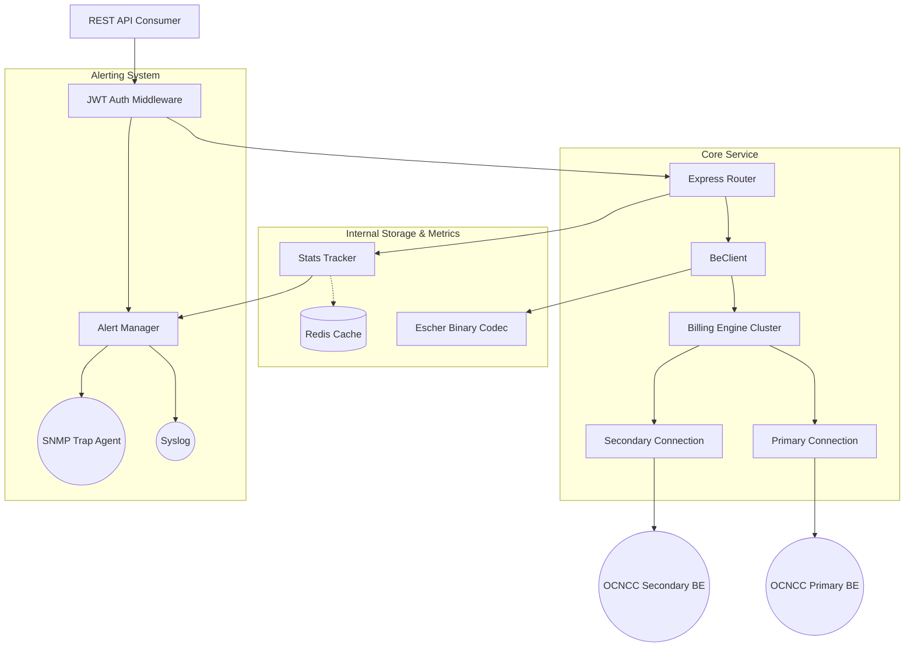

# BBS OCNCC Billing Engine Architecture

The following diagram illustrates the data flow and component relationships within the service.

## Key Workflows

### 1. Request Handling
1. **Validation:** Inbound JSON is validated and transformed (Friendly -> Raw).
2. **Routing:** [BillingEngine](file:///Users/tcraven/Desktop/BeClient/js/billing-engine.js#15-309) selects the healthy connection (prioritizing `preferredEngine`).
3. **Encoding:** `EscherCodec` packs the JSON into a binary TLV payload.
4. **Transmission:** Binary data is sent over the TCP socket.
5. **Collection:** Response is captured, decoded, and transformed back to JSON.

### 2. High Availability
- **Failover:** If the Primary connection drops, requests are automatically re-routed to Secondary.
- **Failback:** The Primary is continuously monitored. Once it recovers and passes the BEG handshake, it's restored as the priority target.
- **Congestion Control:** Tracks outstanding CMIDs to prevent over-saturating the BE.

### 3. Monitoring Pipeline
- **Real-time:** [StatsTracker](file:///Users/tcraven/Desktop/BeClient/js/stats-tracker.js#14-199) increments counters based on request results (Success/Error/Unauthorised).
- **Persistence:** Local node metrics are synced to Redis to allow multi-instance reporting.
- **Alerting:** Failed auth tokens or forbidden endpoint probes trigger Syslog/SNMP traps instantly.
